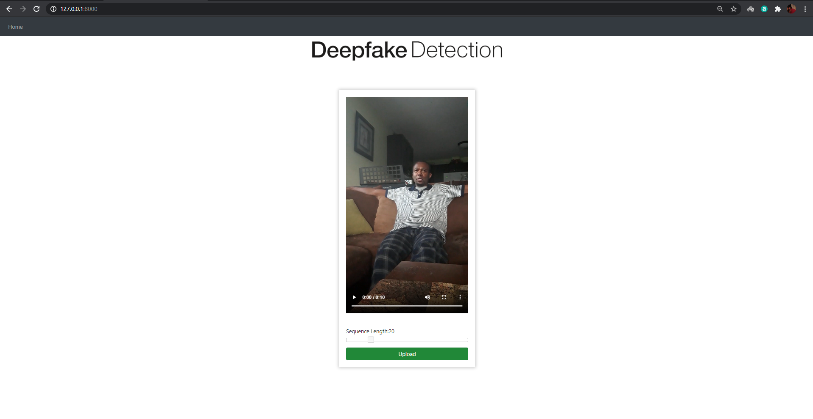
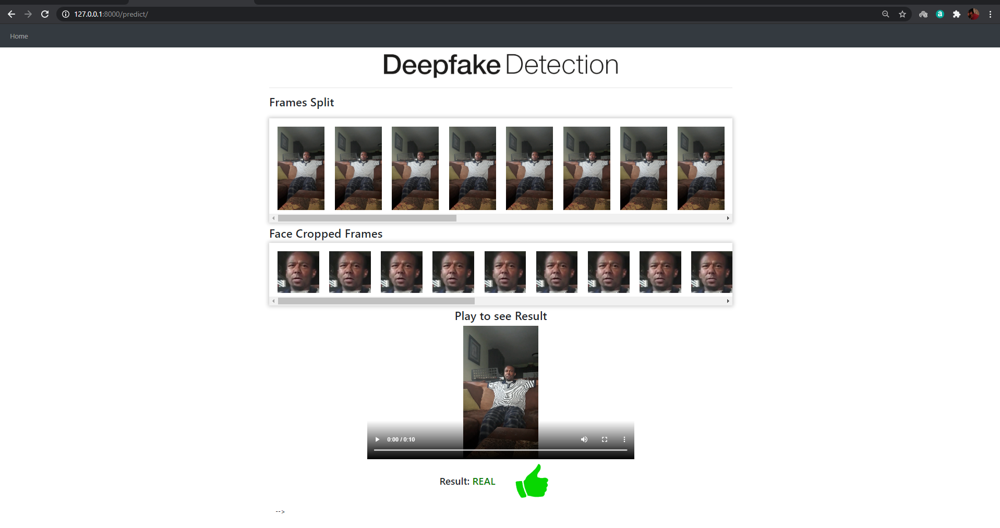
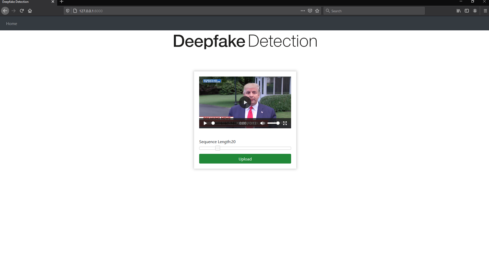
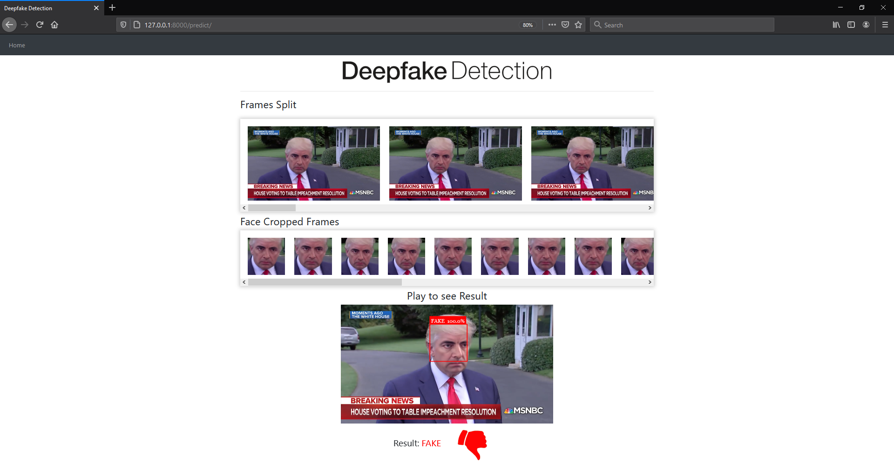

# Deep fake detection 

## Requirements:

**Note :** Nvidia GPU is mandatory to run the application.

You can find the list of requirements in [requirements.txt](https://github.com/ABasral/Deepfake_Detection_Using_RESnet_and_LSTM/blob/master/requirements.txt). Main requirements are listed below:

```
Python >= v3.6
Django >= v3.0
```

## Directory Structure

## Prerequisite
1. Copy your trained model to the models folder.
   - download trained models from the [Google Drive](https://drive.google.com/drive/folders/1OrJFB_MbpD_TdfR7u-yKr43ykWNEs6l8?usp=sharing) 

### Step 1 : Clone the repo 

`git clone https://github.com/ABasral/Deepfake_Detection_Using_RESnet_and_LSTM.git`

### Step 2: Create virtualenv (optional)

`python -m venv venv`

### Step 3: Activate virtualenv (optional)

`venv\Scripts\activate`

### Step 4: Install requirements

`pip install requirements.txt`

### Step 5: Copy Models

`Copy your trained model to the models folder i.e /models/`

- Download trained models from [Google Drive](https://drive.google.com/drive/folders/1OrJFB_MbpD_TdfR7u-yKr43ykWNEs6l8?usp=sharing)

**Note :** The model name must be in specified format only i.e *model_84_acc_10_frames_final_data.pt*. Make sure that no of frames must be mentioned after certain 3 underscores `_` , in the above example the model is for 10 frames.


### Step 6: Run project

`python manage.py runserver`







# Read More about this project and it's working at
[Medium Blog](https://ayushbasral.medium.com/deepfake-detection-using-resnxt-and-lstm-bcc08c086f84)
  

